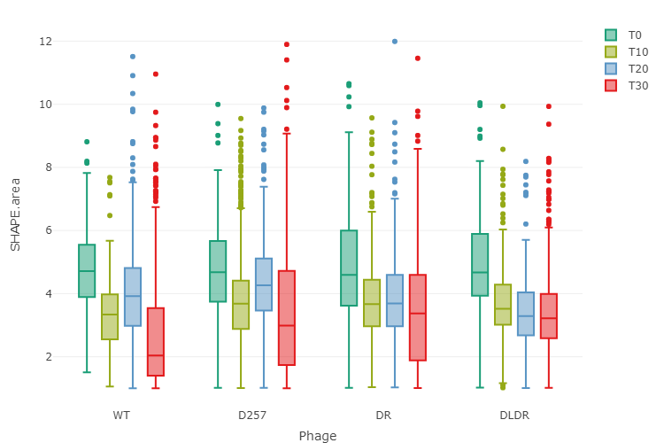
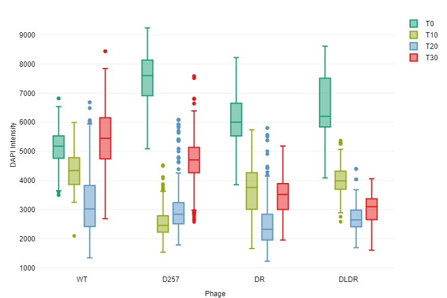

20200923-Infection\_Microscopy
================
Ramirez\_Luis
23/09/2020

``` r
knitr::opts_chunk$set(echo=TRUE, warning=FALSE, message=FALSE)
knitr::knit_meta(class=NULL, clean = TRUE)
```

    ## list()

``` r
if (!require("FactoMineR")) install.packages("FactoMineR", dependencies = TRUE) ; library(FactoMineR)
if (!require("factoextra")) install.packages("factoextra", dependencies = TRUE) ; library(factoextra)
if (!require("plotly")) install.packages("plotly", dependencies = TRUE) ; library(plotly)
if (!require("tibble")) install.packages("tibble", dependencies = TRUE) ; library(tibble)
if (!require("gridExtra")) install.packages("gridExtra", dependencies = TRUE) ; library(gridExtra)
#install.packages('RMySQL', repos='http://cran.us.r-project.org')
#if (!require("")) install.packages("")
if (!require("backports")) install.packages("backports", dependencies = TRUE) ; 
if (!require("curl")) install.packages("curl", dependencies = TRUE) ; 
if (!require("haven")) install.packages("haven", dependencies = TRUE) ; 
if (!require("openxlsx")) install.packages("openxlsx", dependencies = TRUE) ; 
```

Charge the libraries for this analysis

# Read the csv file

read files, with column names already in the file `(headers=T)`, and
data separated by colon `(sep=";")`

``` r
bacteria.df1 <- read.csv("./2020092301-MJ-raw-Bacteria.csv", header=T, row.names=NULL, sep=",")
maxima1.df1 <- read.csv("./2020092301-MJ-raw-Maxima1.csv", header=T, row.names=NULL, sep=",")
```

Column names of `bacteria.df` dataframe

    colnames(bacteria.df1)

    colnames(maxima1.df1)

Select the columns to be kept

``` r
bacteria.newColumns <- c("NAME.id", "EXPERIMENT.name", "MAXIMA.Maxima1.count", 
                         "SHAPE.angularity.mean", "SHAPE.area", "SHAPE.circularity", 
                         "SHAPE.curvature", "SHAPE.length", "SHAPE.width", 
                         "SHAPE.perimeter")

maxima1.newColumns <- c("NAME.id", "EXPERIMENT.name", "INTENSITY.ch1.mean", "INTENSITY.ch2.mean",
                        "INTENSITY.ch3.mean",
                        "PARENT.location.cartesian.x", "PARENT.location.cartesian.y", 
                        "PARENT.location.orthogonal.x", "PARENT.location.orthogonal.y")
```

``` r
bacteria.df2 <- bacteria.df1[,which(colnames(bacteria.df1) %in% bacteria.newColumns)]
maxima1.df2  <- maxima1.df1[,which(colnames(maxima1.df1) %in% maxima1.newColumns)]
```

``` r
bacteria.df3 <- bacteria.df2 %>% separate(EXPERIMENT.name, c("DATE","Time","Order","Phage"))
maxima1.df3 <- maxima1.df2 %>% separate(EXPERIMENT.name, c("DATE","Time","Order","Phage"))
```

Visualize the distribution of foci across the cells at different times

``` r
max.df <- maxima1.df3
InfTime <- c("T0","T10","T20","T30")
PhagStrain <- c("WT", "D257", "DR", "DLDR")

maxPlot <- function(i,j,k){
  test <- max.df[(max.df$Phage==i) & (max.df$Time==j),]
  x <- test$PARENT.location.orthogonal.x
  y <- test$PARENT.location.orthogonal.y
  ggplot(test, aes(y, x))+geom_hex(bins = 25)+scale_fill_gradientn("", colours = rev(rainbow(10, end = 4/6)))+
    scale_y_continuous(breaks=seq(-5,5,2), limits=c(-5,5))+
    scale_x_continuous(breaks=seq(-2,2,1), limits=c(-2,2))+
    annotate("text", x=0, y=4.5, label=k, size=2.5) +
    theme_classic()+
    theme(legend.position = "none", 
          axis.text.x = element_blank(), axis.title.x = element_blank(),
          axis.text.y = element_blank(), axis.title.y = element_blank())+
    geom_ellipse(aes(x0 = 0, y0 = 0, a = 1, b = 3.5, angle = 0, m1=2, m2=3))
}

p <- list()
for(i in PhagStrain){
  for (j in InfTime){
    k <- paste(i,j,sep=" - ")
    p[[k]] <- maxPlot(i,j,k)
  }}

g <- do.call(grid.arrange, c(p,ncol=8))
```

<!-- -->

``` r
#ggsave("./Maxima1-orthogonal.png", g, width = 16,  height = 5,  units = "cm" )
```

\#Distribution of Parameters

``` r
colnames(bacteria.df3)
```

    ##  [1] "NAME.id"               "DATE"                  "Time"                 
    ##  [4] "Order"                 "Phage"                 "MAXIMA.Maxima1.count" 
    ##  [7] "SHAPE.angularity.mean" "SHAPE.area"            "SHAPE.circularity"    
    ## [10] "SHAPE.curvature"       "SHAPE.length"          "SHAPE.perimeter"      
    ## [13] "SHAPE.width"

``` r
bacteria.df3$Phage <- factor(bacteria.df3$Phage,levels=PhagStrain)
maxima1.df3$Phage <- factor(maxima1.df3$Phage,levels=PhagStrain)

mycolors = c(brewer.pal(name="Dark2", n = 8), brewer.pal(name="Paired", n = 6))
```

Distribution of area

    plot_ly(bacteria.df3, x=~Phage, y=~SHAPE.area, color=~Time, colors = mycolors, type="box",
              text = paste(bacteria.df3[,"NAME.id"])) %>% layout(boxmode = "group", xaxis = list(title = "Phage"), autosize = F, width = 750, height = 500, automargin = TRUE)



Plot the relative DAPI intensity across time

    font1 <- list(
      family = "Arial, sans-serif",
      size = 12,
      color = "black"
      )
    
    plot_ly(maxima1.df3, x=~Phage, y=~INTENSITY.ch1.mean, color=~Time, colors = mycolors, 
            type="box", text = paste(maxima1.df3[,"NAME.id"])) %>%
      layout(boxmode = "group", 
             xaxis = list(title = "Phage", titlefont=font1, tickfont=font1), 
             yaxis=list(title = "DAPI Intensity", titlefont=font1, tickfont=font1), 
             legend=list(font=font1),
             autosize = F, width = 750, height = 500, automargin = TRUE)



Build grid of p-values from pairwise comparison: 1. Function to perform
Tukey HSD test:

``` r
TukeyAllParams <- function(paramToTest, df){
  df.lm <- lm(df[,paramToTest] ~ Phage , data = df)
  df.av <- aov(df.lm)
  tukey.test <- TukeyHSD(df.av, conf.level = 0.9999)
  params.df <- data.frame(Comparisons=rownames(tukey.test$Phage), tukey.test$Phage[,"p adj"])
  params.df2 <- params.df %>% separate(Comparisons, c("Gene1", "Gene2"))
  params.df3 <- params.df2[which((params.df2$Gene1 %in% RefPhage) | (params.df2$Gene2 %in% RefPhage)),]
  params.df3[params.df3 == RefPhage[1]] <- NA
  params.df4 <- data.frame(t(apply(params.df3,1,function(x) x[!is.na(x)])))
  colnames(params.df4) <- c("Phage", paramToTest)
  rownames(params.df4) <- NULL
  return(params.df4)
  }
```

2.  Apply function and make a stack of p-values translated in color
    intensity

<!-- end list -->

``` r
RefPhage <- c("WT")
bacteria.newCol2 <- colnames(bacteria.df3)[6:length(colnames(bacteria.df3))]
PhageList2 <- setdiff(levels(bacteria.df3$Phage), RefPhage)
p.All <- data.frame(Phage=PhageList2)
for (i in bacteria.newCol2){
  p.All <- merge(p.All, TukeyAllParams(i, bacteria.df3[bacteria.df3$Time=="T10",]), by = "Phage", all.x = TRUE)
}

p.All2 <- column_to_rownames(p.All, "Phage")

p.All3 <- p.All2 %>%
  rownames_to_column() %>%
  gather(colname, value, -rowname)

p.All3$rowname <-factor(p.All3$rowname, levels=PhageList2)
p.All3$value <- cut(as.numeric(p.All3$value),breaks =c(-Inf, 1e-6, 1e-3, 0.01, 0.05, Inf))
p.plot <- ggplot(p.All3, aes(x=rowname, y=colname, fill=value))+geom_tile()+
    theme(axis.title.x = element_blank(),
          axis.title.y = element_blank(), 
          axis.text.x = element_text(color = "black", size=12),
          axis.text.y = element_text(color = "black", size=12),
          legend.text = element_text(color = "black", size=12))+
  scale_fill_brewer(palette = "OrRd", direction=-1)
p.plot
```

<!-- -->

``` r
#ggsave("./pVal-TukeyHSD-T10.png", p.plot, width = 20,  height = 10,  units = "cm" )
```
