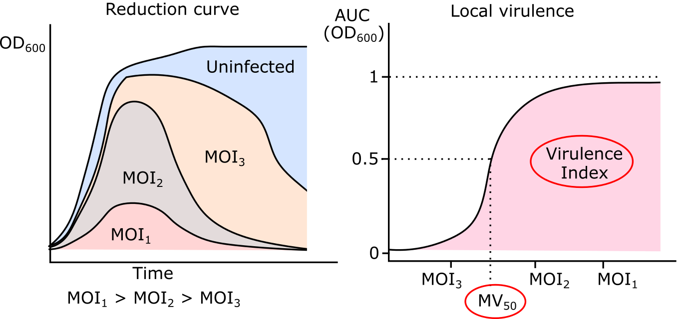
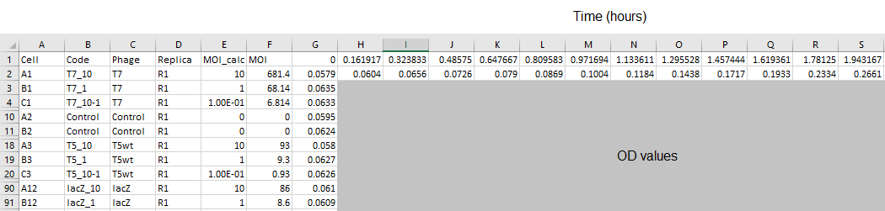
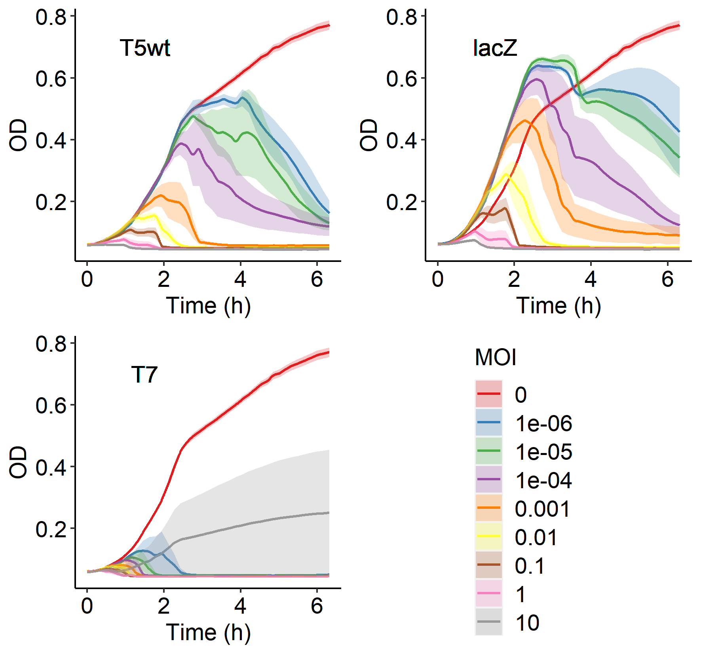
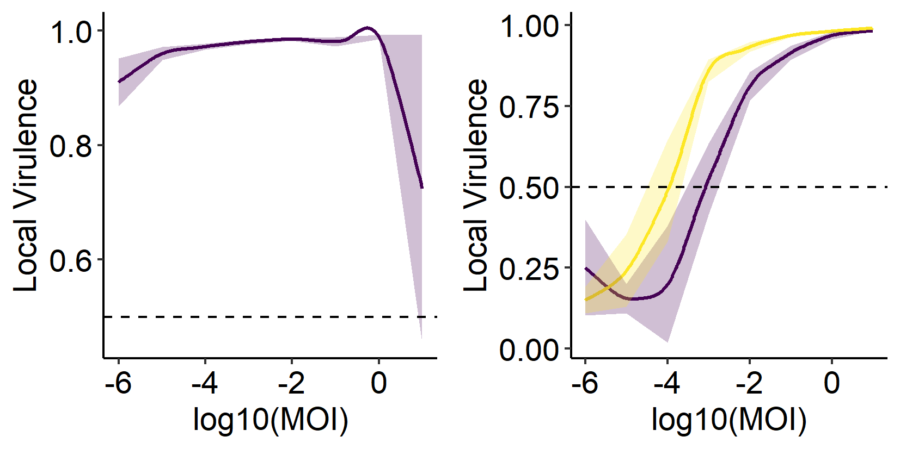
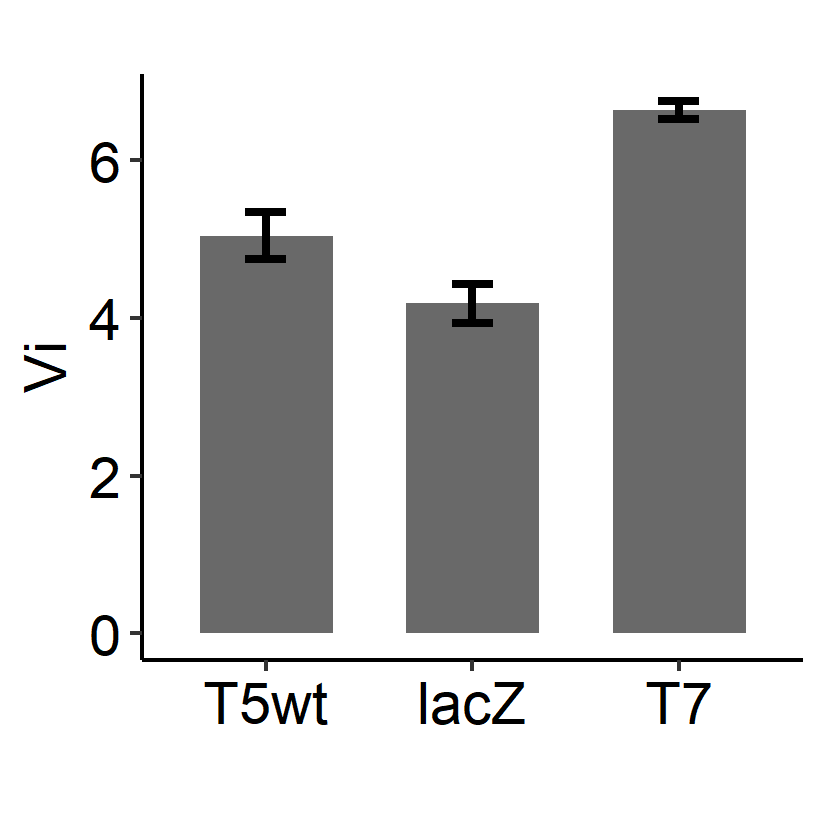
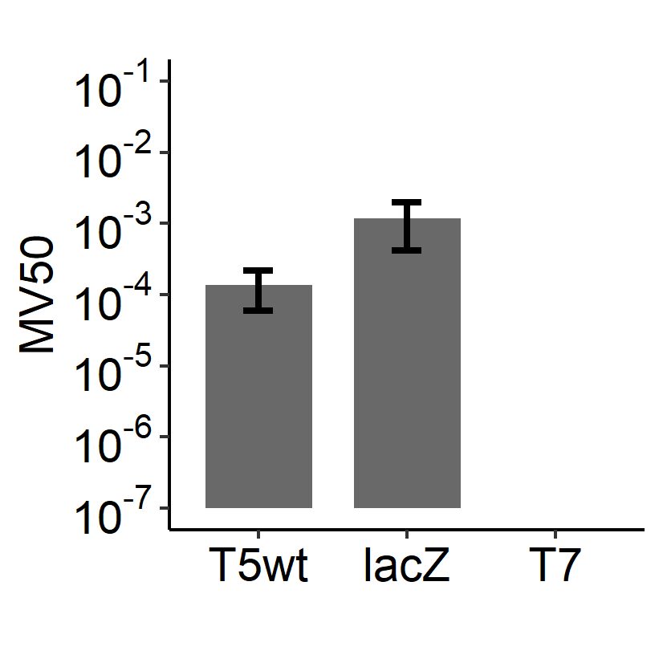

VirulenceIndex
================
Ramirez\_Luis

``` r
# functions: melt
if (!require("reshape2")) install.packages("reshape2") ; library(reshape2) 
# functions: sort_by
if (!require("dplyr")) install.packages("dplyr") ; library(dplyr)
# functions: ggplot, geom_point, geom_smooth
if (!require("ggplot2")) install.packages("ggplot2"); library(ggplot2)
# functions: geom_xspline
if(!require("ggalt")){install.packages("ggalt")}; library(ggalt)
# functions: auc
if (!require("MESS")) install.packages("MESS") ; library(MESS)
# palette: viridis
if (!require("viridis")) install.packages("viridis") ; library(viridis)
# function: ggarrange()
if (!require("ggpubr")) install.packages("ggpubr") ; library(ggpubr)
# Compute the analysis of variance
if (!require("PMCMR")) install.packages("PMCMR") ; library(PMCMR)

if (!require("tidyr")) install.packages("tidyr") ; library(tidyr)
# functions: 
sem <- function(x,na.rm=FALSE) sd(x, na.rm=na.rm)/sqrt(length(x))
```

## R Markdown

This notebook intend to analyze results from bacterial reduction curves
to obtain three parameters: - Local virulence (\(v_i\)) - MOI required
to produce a local virulence of 0.5 (\(MV_{50}\)) - Virulence Index
(\(V_P\))



Data must be collected in the following manner:
 The first step consists on reading the .csv
file:

``` r
data1 = read.csv("Infection_Mutants2.csv", header=FALSE, sep=",", check.names=FALSE)
data1[1,] <- data1[1,] %>% mutate_if(is.numeric, round, digits = 3)
data1 <- data1[,c(-1, -2,-6)]
colnames(data1) <- c("Phage", "Replica", "MOI", data1[1,c(-1, -2, -3)])
data1 <- data1[c(-1),]
```

Then, to set it in a computer-readable format:

``` r
m.df <- melt(data1, id=c("Phage", "MOI", "Replica"), variable.name = "Time", value.name = "OD")
m.df$Time <- as.numeric(levels(m.df$Time))[m.df$Time]
m.df$MOI <- as.numeric(levels(m.df$MOI))[m.df$MOI]
```

    ## Warning: NAs introduced by coercion

``` r
m2.df <- m.df %>% 
  group_by(Phage, MOI, Time) %>% 
  summarize(
    avg = mean(OD), 
    avg.top=mean(OD)+sem(OD),
    avg.bot=mean(OD)-sem(OD), 
    error=sem(OD))
m2.df$MOI <- as.factor(m2.df$MOI)
```

Determine the minimal bacterial doubling time:

``` r
cc <- m2.df[(m2.df$Phage == "Control"),]
avg_of_Time_mean <- splinefun(cc$Time, cc$avg)
avg_of_Time_err <- splinefun(cc$Time, cc$error)
print(paste("Average bacterial doubling time: ", max(avg_of_Time_mean(cc$Time, deriv = 1))*60,"±", max(avg_of_Time_err(cc$Time, deriv = 1))*60 , "minutes"), sep="")
```

    ## [1] "Average bacterial doubling time:  20.8899817984769 ± 0.874365554316245 minutes"

First let’s see the different levels for the variable `Phage`

    phages <- levels(m2.df$Phage) ; phages

Let’s plot the data to see the behavior of all the different strains:

``` r
plot.OD_Time <- function(x1, x2) {
  #x1, x2: phages to be plotted 
  data.subset <- m2.df[(m2.df$Phage %in% c(x1, x2)),]
  ggplot(data.subset, aes(x=Time, y=avg, group=MOI)) +
    scale_color_brewer(palette = "Set1")+
    scale_fill_brewer(palette = "Set1")+
    geom_xspline(aes(x=Time, y=avg, colour=MOI), spline_shape=-0.5, size=0.75)+
    geom_ribbon(aes(x=Time, ymin=avg.bot, ymax=avg.top, fill=MOI), alpha=.25, linetype=0)+
    theme(panel.background = element_blank(), axis.line = element_line(colour = "black"),
        axis.text.x = element_text(color = "black", size = 14),
        axis.text.y = element_text(color = "black", size = 14),
        axis.title = element_text(color = "black", size = 14), 
        legend.title = element_text(colour = "black", size = 14),
        legend.text = element_text(colour = "black", size = 14))+
    scale_x_continuous(name="Time (h)")+ 
    scale_y_continuous(name="OD")+
    geom_text(label=x1, x=1.5, y=0.7, size = 5)
}

phages3 <- c("T5wt", "lacZ", "T7")
p11 <- plot.OD_Time(phages3[1], "Control")
p12 <- plot.OD_Time(phages3[2], "Control")
p13 <- plot.OD_Time(phages3[3], "Control")
leg <- get_legend(p11)

g <- ggarrange(p11, p12, p13, as_ggplot(leg), ncol = 2, nrow = 2, common.legend = TRUE, legend="none")
#ggsave("./OD_Time-test.png", g, width = 15,  height = 14,  units = "cm" )
```



``` r
data1$area <- apply(data1[,4:42], 1, MESS::auc, y=colnames(data1[,4:42]))
uninfected <- data1[data1$Phage == "Control",]
A0 <- mean(uninfected$area)
auc2 <-function(x){return(1-x/A0)}
data1$Vi <- sapply(data1$area, auc2)
data1$log10.MOI <- log10(as.numeric(as.character(data1$MOI)))
```

``` r
Vi_logMOI.df <- data1 %>% 
  group_by(Phage, log10.MOI) %>% 
  summarize(
    Vi.avg = mean(Vi), 
    Vi.top=mean(Vi)+sem(Vi),
    Vi.bot=mean(Vi)-sem(Vi))
Vi_logMOI.df <- Vi_logMOI.df[Vi_logMOI.df$Phage != "Control",]
```

``` r
plot.Vi_logMOI <- function(...) {
  #x1, x2: phages to be plotted 
  data.subset <- Vi_logMOI.df[(Vi_logMOI.df$Phage %in% c(...)),]
  ggplot(data.subset, aes(x=log10.MOI, y=Vi.avg, group=Phage)) +
    scale_color_viridis(discrete = TRUE, option = "D")+
    scale_fill_viridis(discrete = TRUE) +
    geom_xspline(aes(x=log10.MOI, y=Vi.avg, colour=Phage), spline_shape=-0.5, size=0.75)+
    geom_ribbon(aes(x=log10.MOI, ymin=Vi.bot, ymax=Vi.top, fill=Phage), alpha=.25, linetype=0)+
    theme(panel.background = element_blank(), axis.line = element_line(colour = "black"),
        axis.text.x = element_text(color = "black", size = 14),
        axis.text.y = element_text(color = "black", size = 14),
        axis.title = element_text(color = "black", size = 14), 
        legend.title = element_text(colour = "black", size = 14),
        legend.text = element_text(colour = "black", size = 14))+
    scale_x_continuous(name="log10(MOI)") + 
    scale_y_continuous(name="Local Virulence") + 
    geom_hline(yintercept = 0.5, linetype = "dashed")
}
set1 <- plot.Vi_logMOI("T7")
set2 <- plot.Vi_logMOI("T5wt", "lacZ")

set12.plot <- ggarrange(set1, set2, ncol = 2, nrow = 1, legend="none")

#ggsave("./Vi_log10MOI-test.png", set12.plot, width = 14,  height = 7,  units = "cm" )
```

 Determine the Virulence Index for the
strains

``` r
to_test <- c("T5wt", "lacZ", "T7")

Vi_logMOI_Vp <- data1[(data1$Phage %in% to_test),] %>% 
  group_by(Phage, Replica) %>% 
  summarize(Vp = MESS::auc(x=log10.MOI, y=Vi))
```

    ## Warning in regularize.values(x, y, ties, missing(ties)): collapsing to unique
    ## 'x' values

``` r
Vi_logMOI2 <- Vi_logMOI_Vp %>% spread(Replica, Vp)

Vi_logMOI2$avg <- apply(Vi_logMOI2[,c(-1)], 1, mean, na.rm=TRUE)
Vi_logMOI2$error <- apply(Vi_logMOI2[,c(-1, -5)], 1, sem, na.rm=TRUE)
Vi_logMOI2$Phage <- factor(Vi_logMOI2$Phage, levels=to_test)

g <- ggplot(Vi_logMOI2)+
  geom_segment(aes(x=Phage, xend=Phage, y=0, yend=avg), colour="dimgray", size=15)+
  geom_errorbar(aes(x=Phage, ymin=avg-error, ymax=avg+error), width=0.2, size=1) +
  theme(panel.background = element_blank(), axis.line = element_line(colour = "black"),
        axis.text.x = element_text(color = "black", size=14),
        axis.text.y = element_text(color = "black", size=14),
        axis.title = element_text(color = "black", size=14), 
        legend.title = element_text(color = "black", size=14),
        legend.text = element_text(color = "black", size=14))+
  labs(y="Vi", x="", tag="")

#ggsave("./VirulenceIndex-test.png", g, width = 7,  height = 7,  units = "cm" )
```



``` r
kruskal.test(Vp ~ Phage, data= Vi_logMOI_Vp)
```

    ## 
    ##  Kruskal-Wallis rank sum test
    ## 
    ## data:  Vp by Phage
    ## Kruskal-Wallis chi-squared = 6.25, df = 2, p-value = 0.04394

``` r
posthoc.kruskal.dunn.test(x=Vi_logMOI_Vp$Vp, g=Vi_logMOI_Vp$Phage, p.adjust.method="none")
```

    ## 
    ##  Pairwise comparisons using Dunn's-test for multiple 
    ##                          comparisons of independent samples 
    ## 
    ## data:  Vi_logMOI_Vp$Vp and Vi_logMOI_Vp$Phage 
    ## 
    ##      lacZ  T5wt 
    ## T5wt 0.134 -    
    ## T7   0.014 0.264
    ## 
    ## P value adjustment method: none

``` r
MV50 <- function (X, Y) {
  hypoline <- ggplot() + geom_xspline(aes(x=X, y=Y))
  bond.df <- layer_data(hypoline, 1)
  mv50 <- bond.df[which.min(abs(bond.df$y-0.5)),]$x
  return (c(10^mv50))
}


mv50.df <- data1[(data1$Phage %in% to_test),] %>% 
  group_by(Phage, Replica) %>% 
  summarize(mv50 = MV50(log10.MOI, Vi))

mv50.df2 <- mv50.df %>% spread(Replica, mv50)

mv50.df2$avg <- apply(mv50.df2[,c(-1)], 1, mean, na.rm=TRUE)
mv50.df2$error <- apply(mv50.df2[,c(-1, -5)], 1, sem, na.rm=TRUE)
mv50.df2$Phage <- factor(mv50.df2$Phage, levels=to_test)

p <- ggplot(mv50.df2)+
  geom_segment(aes(x=Phage, xend=Phage, yend=avg, y=1e-7), colour="dimgray", size=15)+
  geom_errorbar(aes(x=Phage, ymin=avg-error, ymax=avg+error), width=0.2, size=1) +
  scale_y_continuous(trans = "log10",
                     breaks = scales::trans_breaks("log10", function(x) 10^x, n=6),
                     labels = scales::trans_format("log10", scales::math_format(10^.x)),
                     limits = c(1e-7,1e-1))+
  theme(panel.background = element_blank(), axis.line = element_line(colour = "black"),
        axis.text.x = element_text(color = "black", size=14),
        axis.text.y = element_text(color = "black", size=14),
        axis.title = element_text(color = "black", size=14), 
        legend.title = element_text(color = "black", size=14),
        legend.text = element_text(color = "black", size=14))+
  labs(y="MV50", x="", tag="")

#ggsave("./MV50-test.png", p, width = 7,  height = 7,  units = "cm" )
```



``` r
# Compute the analysis of variance
kruskal.test(mv50 ~ Phage, data = mv50.df)
```

    ## 
    ##  Kruskal-Wallis rank sum test
    ## 
    ## data:  mv50 by Phage
    ## Kruskal-Wallis chi-squared = 0.69444, df = 2, p-value = 0.7066

``` r
posthoc.kruskal.dunn.test(x=mv50.df$mv50, g=mv50.df$Phage, p.adjust.method="none")
```

    ## 
    ##  Pairwise comparisons using Dunn's-test for multiple 
    ##                          comparisons of independent samples 
    ## 
    ## data:  mv50.df$mv50 and mv50.df$Phage 
    ## 
    ##      lacZ T5wt
    ## T5wt 0.40 -   
    ## T7   0.71 0.71
    ## 
    ## P value adjustment method: none
